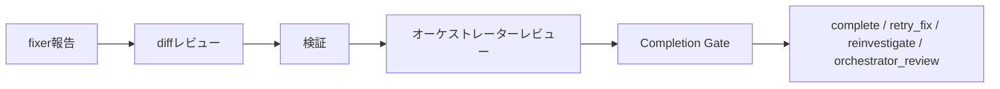

エージェントに実装を任せるとき、一番難しいのは終わりの判断だ。テストが通っていても、頼んだ範囲を超えた変更が混ざっていることがある。

自分はagent-orchestrationというスキルで調査と実装を別々のエージェントに振り分け、完了の判断だけを自分に残している。その判断の助言役として、TypeSafeの意思決定モデルJevを組み込んだ。

8件の試運転では自分の判断と全一致し、わざと壊した3件も正しい行き先に振り分けられた。そこで完了してよいかをJevに聞く関門（Completion Gate）を有効化した。この線引きが設計の中心だ。

この記事で分かることは4つだ。Jevをどこに置いたか。Completion Gateの仕組み。shadow評価の中身。使い始め方。

## 完了の判断はそれでも人間がする

fixerの「できました」は主張であって証拠ではない。これはスキルの最初からの前提で、オーケストレーターは実際のdiffを自分で読み、検証を自分で実行し直す決まりになっている。

それでも最後の「終わりでよい」という判断は、オーケストレーターの胸先三寸だった。テストが通ってdiffに納得したら終わりにする。この判断にもう一枚だけ、独立した目を入れたい。そこでJevを足した。

JevはTypeSafeの意思決定モデルで、文章を生成しない。`state`と型付きの`questions`を渡すと、`noul`・`choice`・`score`の確率を返す。自分はCommand CodeのGOATプラン経由で`typesafe/jev`を使っている。Headlessの一発判定として呼ぶ。

## Jevは6番目の判断材料に置く

置き場所を間違えると、Jevが実質の決定者になってしまう。そうしないために優先順位を明文化した。上にあるものが勝つ。

```text
user > safety > skill invariants > persisted config > deterministic verification > Jev > conservative fallback
```

テストが失敗しているのにJevが`complete=0.99`と言っても終わらない。Jevはpolicyの中で使うjudgmentだ。

呼び出しの形も縛った。skillからJevを直接呼ばない。間に`scripts/jevctl`を挟み、Command Code固有の仕様(リクエスト形状、`cmd`呼び出し、終了コード、応答スキーマ)は全部その中に閉じ込めた。skill側が受け取るのは正規化されたJSONだけだ。Jevを無効化・削除しても既存のワークフローはそのまま動く。

呼ぶのは一度きりで、場所は決まっている。fixer報告、diffレビュー、検証、オーケストレーターレビューの全部が済んでからだ。



Jevに渡すのは確定済みの報告だけだ。`task_summary`、`root_cause_summary`、`implementation_summary`、`changed_files`、`diff_stats`、`verification`、`tests_summary`、`remaining_issues`、`review_findings`、`deterministic_pass`の10フィールドで、秘密情報やtranscriptやリポジトリの中身は送らない。stateは12000文字で打ち切り、足りない分は`[state truncated]`の印を付ける。

質問は4つだ。3つの`noul`が証拠の状態を測り、1つの`choice`が次の一手を選ぶ。

| 質問 | 型 | 意味 |
| --- | --- | --- |
| `outcome_supported` | noul | 証拠が要求の達成を支えている確率 |
| `unresolved_issue` | noul | 重大な未解決事項が残っている確率 |
| `scope_exceeded` | noul | 実装が scope を超えている確率 |
| `next_action` | choice | `complete` / `retry_fix` / `reinvestigate` / `orchestrator_review` |

完了と認める条件は3つの連言で、閾値は`jevctl`に集約した。既定値はこうだ。

| 設定 | 既定値 | 通過条件 |
| --- | --- | --- |
| `outcome_min` | 0.90 | `outcome_supported >= 0.90` |
| `unresolved_max` | 0.10 | `unresolved_issue <= 0.10` |
| `scope_max` | 0.15 | `scope_exceeded <= 0.15` |
| `action_conf_min` | 0.80 | `next_action_confidence >= 0.80` |

Jevが呼べない・無効・応答が壊れているときは、一律`orchestrator_review`に倒す。失敗のリトライも別経路へのフォールバックもしない。Jevの失敗はタスクの失敗にしない。この保守的な倒し方が、安心して足せる理由だ。

## 自分のスキルで自分を作った

実装自体をagent-orchestrationで回した。Command CodeとJevの公式ドキュメント調べをexplorerに、実装をfixerに振る。自分で書いた縛りを自分で守る形だ。初版は17の offline テスト付きで入り、レビューで7件の指摘が出て最小修正で直した。

smoke testでは面白いことが起きた。実行環境に`cmd` CLIが入っていなかったので、Jevへの実リクエストは0件のまま、正しくフォールバックした。壊れたのではなく、設計どおりに「聞けなかった」と報告したわけだ。そのあと`cmd`を入れてログインし直し、live リクエストちょうど1回で往復成功を確認した。

ついでにスキルの置き場所も整理した。`SKILL.md`直下に散らかっていた`JEV.md`や`jevctl`を、Agent Skillsの慣習どおり`references/`と`scripts/`に移した。中身は変えず、経路の移動だけだ。この時点で offline テストは52件になっていた。

## shadowで8件、わざと壊して3件

いきなり有効にはしなかった。まずshadowモードで観察した。順序は固定で、オーケストレーターが先に通常どおり判断を固め、その後にJevを最大1回だけ呼ぶ。Jevの結果で決定を変えてはならない。比較だけ記録する。

shadowとactiveの違いは`auto_apply`と`would_auto_apply`の2信号に集約した。activeでは両者が同じ計算に従い、shadowでは`would_auto_apply`だけが「activeならこうしていた」を報告し、`auto_apply`はつねにfalseだ。確信のある`retry_fix`や`reinvestigate`は`decided`になるが、完了以外で自動適用はしない。

評価は専用のfixtureリポジトリ(`jev-shadow-eval`、private)に5ケースで流し、足りなくなって3ケースを足し、計8件にした。結果は8件すべて一致で、`would_auto_apply: true`、`auto_apply: false`が保たれた。

| Case | Orchestrator | Jev | 一致 |
| --- | --- | --- | --- |
| 01〜08 | complete | complete | true(8/8) |

ここで1つ失敗がある。06〜08はnegative-controlのつもりだった。fixtureに落とし穴を仕込んだのだが、fixerが優秀で直してしまい、ゲート到達時には本当にcompleteな状態になっていた。失敗を観測できなかった。

方針を変えた。fixtureを増やすのはやめた。`jevctl`にsettled-stateのnegative probeを3件だけ直接流す。要点は`deterministic_pass: true`にすることだ。falseだとJevを呼ぶ前にshort-circuitするので、Jevの判断力を試せない。

3件ともexact matchだった。危険なcompleteはゼロだ。

| Probe | 状態 | Jevの行き先 | 確信度 |
| --- | --- | --- | --- |
| A | 実装漏れ | `retry_fix` | 0.99 |
| B | 根拠不足 | `reinvestigate` | 1.00 |
| C | scope超過 | `orchestrator_review` | 0.90 |

Probe Cがこの記事の核だ。要求した動作は動いているので`outcome_supported`は0.8と高い。それでも`scope_exceeded`が0.98で、行き先は`orchestrator_review`になった。テストが通ったこととcompleteは別扱いになった。

閾値は変えなかった。positiveとnegativeが今の値できれいに分離できたからだ。設定をactiveに切り替えて、Completion Gateは完成扱いにした。

## 実装前の目も足した。並列は調査だけ

10月1日には実装の前にも目を足した。Explorer Gateだ。Explorerの調査結果をオーケストレーターがレビューしてから、証拠がfixerに渡せるほど十分かをJevに聞く。行き先は`proceed_to_fix` / `explore_more` / `orchestrator_review`の3つで、`proceed_to_fix`は助言であって承認ではない。`auto_apply`はつねにfalseで、止められるのは確信のある`explore_more`だけだ。既定はshadowで、手元ではCompletion active・Explorer shadowで回している(2026-10-09時点)。

並列調査v1も同じ日に実装した。読み取り専用の独立unitを2〜3だけ並べ、調査の待ち時間を縮める。採否と収束は`parallel_validate`で見る。Fixerの並列はなし、ExplorerとFixerの重なりもなし。書き込みの直列は変えない。Parallel Gateは作らなかった。

この2つは本記事では見取り図までにする。主役はCompletion Gateで、残りは動きを見てから書く。

## 使い始め方

前提はHerdrのセッション(`HERDR_ENV=1`)とherdrスキルだ。Herdrの外では単一エージェントの作業にフォールバックする。

まず診断だけ回す。`doctor`はモデルを呼ばない。

```bash
skills/agent-orchestration/scripts/sessionctl inspect
skills/agent-orchestration/scripts/jevctl doctor
```

使うと決めたら`jev.json`に書く。いきなりactiveにせず、shadowから始めるのがおすすめだ。

```json
{
  "enabled": true,
  "mode": "shadow"
}
```

shadowなら普段の使い方は何も変わらない。末尾に`## Jev Shadow`の比較が出るだけだ。一致率を見て、納得したらactiveに上げる。起動時の質問は増えないし、ExplorerとFixerの保存も変わらない。

```sh
npx skills@latest add j1nn0/skills -s agent-orchestration
```

## 残る制約

Jevは万能の判定者ではない。送れるのは確定済みの要約だけで、生の証拠は見ない。確信度は確率の見積もりであって証明ではない。料金や仕様は変わるので、使う前にCommand Codeのモデルページと手元の`references/jev.md`を確認してほしい。

それでも「終わりでよい」の隣にもう一人置けたのは大きい。判定の層でも、レビューと実装を別の頭で進める分離が保たれた。3エージェント構成を試すなら、最初に「何を委譲しないか」を決めることから始めるといい。自分は判断とレビューを残し、Jevには終わりの点検だけを渡した。この線がどこにあるかで、スキルの形は変わる。
