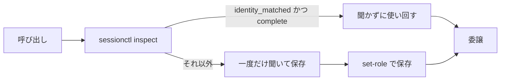

agent-orchestrationは調査と実装だけを別のエージェントに委ねるスキルだ。前回は委譲先をpiに寄せ、モデルまで固定した([前回の記事]())。そのあと自分は固定表をやめた。ハーネス・モデル・エフォートはスキルが決めない。最初にユーザーが選んだ設定をセッションに保存する方式に変えた。

理由は二つある。固定表は書いた時点では正しくても、使う環境が変わると外れる。別の環境ではそのモデルが無いこともある。逆に毎回聞き直すのも嫌だ。タスクが終わるたびにスキルが同じ3点を聞き直したら、委譲の往復より確認の往復のほうが重くなる。

今の形はこうだ。スキルが設定を聞くのは最初の一回と変えたいときだけだ。保存済みの設定があれば聞かない。保存と合わなければ黙って変えずに止める。

## 固定表をやめて選択式にする

9月11日の変更(`6876485`)で、役割表からモデル名が消えた。`Pi explorer` / `Pi fixer` だった欄が、`Session-configured explorer` / `Session-configured fixer` になった。

スキルの聞き方は決まっている。最初にこのコマンドを流す。

```bash
herdr integration status
```

スキルはHerdrに入っている連携のうち、エージェントとして起動できるkindをハーネスの選択肢にする。両方の役割をまとめて聞くのが基本で、形はこうだ。

```text
Explorer
  Harness:
  Model:
  Effort:

Fixer
  Harness:
  Model:
  Effort:
```

ユーザーが選ぶ。スキルは代わりに選ばない。起動コマンドもハーネスに合わせる。`--`の後ろはそのハーネスに渡す引数で、モデルとエフォートの渡し方はハーネスが決める。スキルは選んだ値のどちらも黙って省かないし、ハーネスの既定値にも落とさない。

選んだ設定はそのセッションでは固定だ。新しいunit、エージェントの再起動、リトライ、ペインの作り直しは聞き直しの理由にならない。ユーザーが明示したときだけ変える。

スキルは選んだ設定が使えなくなったときの扱いも決めている。モデルが無い場合も、プロバイダのエラーや起動の失敗があっても、スキルは自動で代替品に切り替えない。スキルはどの値が使えないかをユーザーに伝えて、代わりを選んでもらう。もう片方の役割の設定はそのまま残す。

## 保存先は会話ではなくagent_sessionに紐づく

9月14日の変更(`b9cdf32`)で、スキルは選んだ設定をファイルに保存するようになった。置き場所はユーザーのXDG stateディレクトリで、鍵はHerdrのネイティブな`agent_session`の3点(`source`、`kind`、`value`)だ。

```text
${XDG_STATE_HOME:-$HOME/.local/state}/agent-orchestration/session-<key>.json
```

スキルはファイルに役割の設定だけを入れる。認証情報、トークン、プロンプト、調査結果、実装の中身は入れない。

```json
{
  "schema_version": 2,
  "orchestrator_session": {
    "source": "<agent_session.source>",
    "kind": "<agent_session.kind>",
    "value": "<agent_session.value>"
  },
  "explorer": {
    "harness": "<selected harness>",
    "model": "<selected model>",
    "effort": "<selected effort>"
  },
  "fixer": {
    "harness": "<selected harness>",
    "model": "<selected model>",
    "effort": "<selected effort>"
  }
}
```

スキルは呼び出すたびに最初にこう確認する。

```bash
skills/agent-orchestration/scripts/sessionctl inspect
```

`inspect`は副作用が無い。スキルはディレクトリを作らず、書式を上げず、書き込まない。スキルは返すJSONで判断する。`identity_matched`と`configuration_complete`が両方trueなら、スキルはその値を読み込んで聞かない。

それ以外の分岐はこうだ。保存が無くても、会話の中に完全な設定がはっきり残っていれば、スキルはそのまま保存して先に進む。この分岐は永続化が入る前に設定したセッションを救う。どちらでもなければスキルは「Role configuration」に進んで一度だけ聞き、決まったらすぐ保存する。役割ごとの保存は`set-role`を1役割ずつ呼ぶ。

```bash
skills/agent-orchestration/scripts/sessionctl set-role --role explorer --harness H --model M --effort E
```

この設定はオーケストレーターのネイティブセッションに紐づく。スキルを呼び直しても、新しい依頼が来ても、タスクが終わっても、新しいタスクが始まっても、unitが変わっても、contextを圧縮しても、スキルは同じ設定を読み直す。片方の役割を変えたらスキルはその役割だけ更新し、もう片方は触らない。タスクやunitが終わってもスキルはstateファイルを消さない。新しいオーケストレーターの会話は別のセッションidentityになるので、別の鍵になる。

流れを図にするとこうなる。



## 合わなければ止める。黙って変えない

自分は10月2日の変更(`fa93256`)で不一致の扱いを固めた。スキルは保存が無いときに作ってよい。あるものを更新するのはidentityが合うときだけだ。合わない保存や読めない保存は、スキルは`ok: false`と理由(`identity_mismatch`など)を返して、`changed: false`のままファイルとディレクトリに触らない。

この規則は`inspect`と`set-role`の両方に効く。どちらも理由があれば失敗する。スキルは合わない設定を読み込んで使わない。

再利用の判定も同じ線だ。スキルが生きているエージェントを使い回すのは、同じタブにいて、kindが決めたハーネスと一致し、モデルとエフォートが設定どおりのときだけだ。

スキルは別のタブのエージェントを使わないし、止めたり作り替えたりもしない。設定が違うエージェントがいたら、スキルはそのハーネスの普通の終了手順で止め、消えるのを待ってから決めた設定で起動し直す。

起動後はオーケストレーターが`herdr agent get`でタブ・kind・モデル・エフォートを確認する。確認できなければスキルはその役割の委譲をやめる。些細で安全な作業ならオーケストレーターが自分でやり、そうでなければエスカレーションする。

スキルは`$HERDR_PANE_ID`や`$HERDR_TAB_ID`をセッションidentityの代わりにしない。Herdrが`agent_session`を出さないときはスキルは新しいstateを保存しない。完全な設定が会話ではっきりしているときだけスキルは使い回し、そうでなければ聞く。

## 最初の一回と変えたいときだけ聞く

使い方は短い。初めてそのセッションで委譲するときだけ、ユーザーはハーネス・モデル・エフォートを両役割分だけ答える。以後は`sessionctl inspect`が通るのでスキルは聞かない。変えたいときはユーザーが明示すれば、スキルはその役割だけ更新する。

公開先は[`j1nn0/skills`](https://github.com/j1nn0/skills)だ。起動と再利用は`skills/agent-orchestration/references/startup.md`の手順に従ってください。細部はそちらにまとめた。

```sh
npx skills@latest add j1nn0/skills -s agent-orchestration
```

## 残る制約

Herdrが`agent_session`を出さない環境ではスキルは設定を保存できない。そのときは会話の明確さに頼るしかなく、聞き直しが出る。stateの書式は1と2のどちらも有効で、スキルは読み取りで書き換えない。変更は書式2で書く。stateファイルは手で直さないし、移行もしない。

設定に有効期限は無い。保存した設定は変えるまで残る。モデル側の値上げや廃止はスキルが見に行かない。スキルは使えなくなった値を、使えなくなったときに聞き直す。それが「黙って変えない」の裏側だ。

前回立てた基準はそのままだ。「委譲先は、CLI の機能の多さで選ばない。役割とモデルを固定できるかで選ぶ」。今回はそこに一文足す。「固定するのはスキルではなく、選んだ設定をセッションに保存することだ」。
