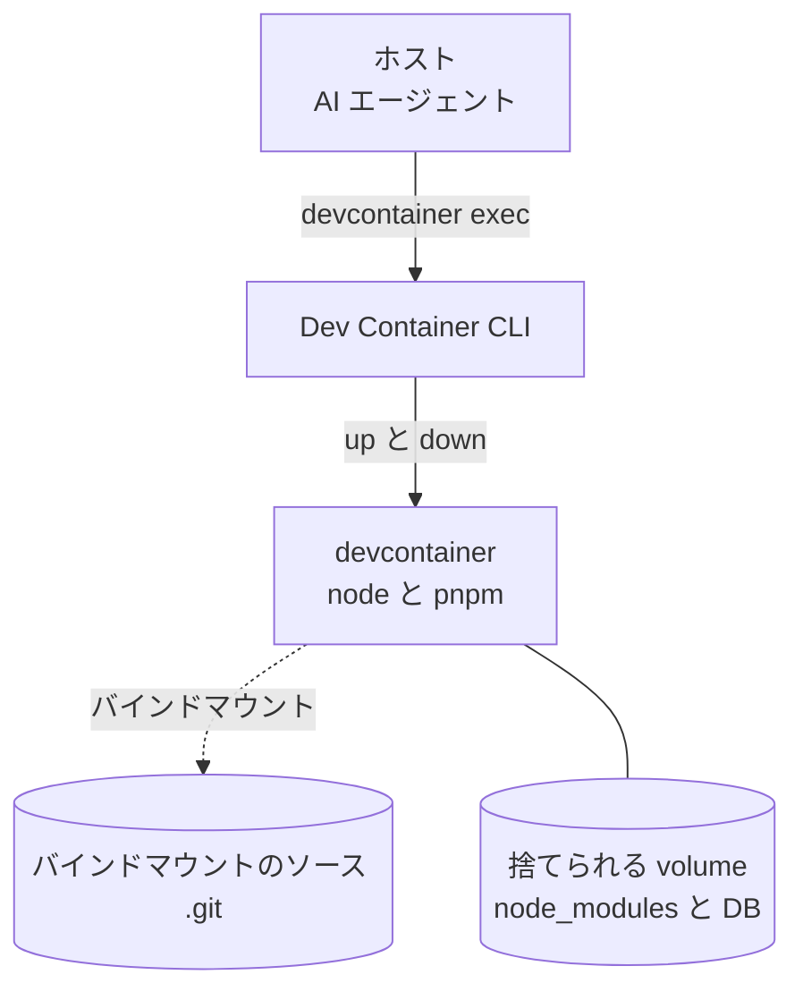

## エージェントに実行させるとホストの環境が汚れる

エージェントに `pnpm install` やビルド、マイグレーションをさせると、ホストの `node_modules` やグローバルな状態、開いたポートが汚れる。
複数のエージェントを同時に動かせば、ポートの取り合いや依存のバージョン違いで互いに邪魔し合う。
自分は前の記事で、エージェントをホストに置き、言語ランタイムだけ `devcontainer exec` でコンテナに流す方針を書いた。
その続きとして、ここではエージェントが投げる実行そのものを隔離されたコンテナに閉じ込め、使い終わったら丸ごと捨てる運用を書く。

## devcontainer を使い捨てのサンドボックスにする

方針は単純だ。
ソースコードはホストと共有してエージェントに読ませるが、実行で生じるゴミはすべてコンテナの内側か volume に閉じ込める。
コンテナを消せば、node_modules も DB の中間データもホストには何も残らない。

全体の関係は次の図のとおりだ。



設定は `.devcontainer/` にまとめる。
ソースはバインドマウントで見えるようにし、node_modules だけは名前付き volume に逃がす。

```json
{
  "name": "agent-sandbox",
  "build": {
    "dockerfile": "Dockerfile"
  },
  "workspaceFolder": "/workspace",
  "mounts": [
    "source=${localWorkspaceFolder},target=/workspace,type=bind,consistency=cached",
    "source=agent_node_modules,target=/workspace/node_modules,type=volume"
  ]
}
```

```dockerfile
FROM node:20-bookworm
RUN corepack enable
WORKDIR /workspace
```

node_modules を volume にした理由は、実行で生じるゴミをホストのバインドマウントに落とさないためだ。
これで、エージェントがいくら `pnpm install` を繰り返しても、ホストの作業ディレクトリは汚れない。

## 危険なコマンドはコンテナの中で実行する

コンテナを起動して、エージェントに代わって実行させたいコマンドを中で走らせる。

```sh
# コンテナを起動（イメージがなければビルドされる）
devcontainer up --workspace-folder .
```

```sh
# エージェントに代わって危険なコマンドをコンテナ内で実行
devcontainer exec --workspace-folder . pnpm install --frozen-lockfile
devcontainer exec --workspace-folder . pnpm run build
```

エージェント本体はホストに置いたまま、実行だけこのコンテナに向ける。
前の記事で書いた「エージェントをコンテナに入れない」方針とも矛盾しない。

## イメージをあらかじめ作っておけば立ち上げは数秒

初回の `devcontainer up` は Dockerfile のビルド込みで数十秒かかる。
2回目以降は Docker の層キャッシュが効き、node のインストールはスキップされるので数秒で上がる。

node_modules は volume に残るので、`pnpm install` も差分だけになる。
自分の環境では、クリーンな状態から毎回作り直すよりも、volume を使い回すほうが実行時間が1桁速かった。

## 終わったコンテナは volume ごと捨てる

使い終わったらコンテナを止める。

```sh
devcontainer down --workspace-folder .
```

ただし `down` だけでは名前付き volume は消えない。
node_modules も捨てたいなら volume を明示的に消す。

```sh
docker volume rm agent_node_modules
```

これでホストにはソースと `.git` だけが残る。
エージェントが環境を壊しても、影響は volume ごと消える範囲に収まる。

## ソースは共有だから、ファイル破壊だけは防げない

隔離できるのはあくまで実行環境だ。
ソースはバインドマウントでホストと共有しているので、エージェントがコンテナ内から `rm -rf` を実行すればホストのファイルも消える。

この運用は「依存や状態を汚さない」ためのもので、「ソースを守る」ためのものではない。
壊されたくないファイルへの破壊的操作は、別の手段でガードする必要がある。

## 使ってみて、壊してもホストに怖い思いをしなくなった

この運用を始めてから、エージェントに気軽に `install` や `build` を任せられるようになった。
失敗しても `devcontainer down` と `docker volume rm` で一掃すれば、ホストは元のきれいな状態のままだ。

複数のエージェントを別々の devcontainer で動かせば、ポートも依存も干渉しない。
前の記事の exec 運用に、この隔離の層を足したことで、実行の副作用を気にせず任せられるようになった。

## よくあるつまずき

■ `devcontainer down` したのに node_modules が残る
名前付き volume が残っている。
`docker volume rm agent_node_modules` で消す。
`down` だけでは volume は消えない。

■ コンテナ内で `rm -rf` したらホストのファイルも消えた
ソースはバインドマウントで共有されている。
コンテナ内からの破壊的ファイル操作はホストに届く。
隔離できるのは実行環境だけだ。

■ 2回目の `up` が相変わらず遅い
Docker の層キャッシュが効いていない。
Dockerfile の `RUN` で重いインストールをやめて、node_modules は volume に逃がしているか確認する。

■ エージェント自体をコンテナに入れるべきか
自分は入れない。
アップデートや認証情報の管理が増える。
エージェントはホスト、実行だけ隔離、という方針を前の記事でも書いた。

エージェントに実行を任せるなら、その副作用もコンテナに閉じ込めるのが一番楽だった。
壊れても捨てればいい環境があれば、気軽に仕事を投げられるようになる。
