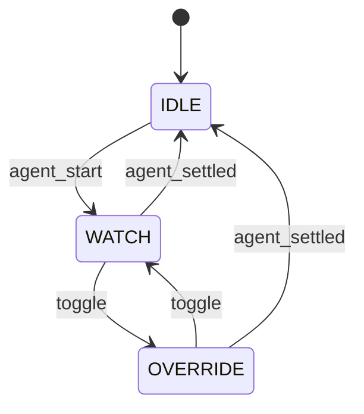

herdr のペインでエージェントの作業を眺めているとき、うっかりキーを押して、起動したエージェントを止めてしまう事故が何件かあった。
[agent-orchestration スキル](https://github.com/j1nn0/skills) で起動したエージェントは、基本は見る専用だ。
それなのにペインにキーが届くと、文字が入力欄に入ったり、Pi のショートカットが発動して実行が止まったりする。

この事故を防ぐ Pi 拡張 [`pi-input-lock`](https://github.com/j1nn0/pi-input-lock) を公開した。
npm は `@j1nn0/pi-input-lock` で、現在のバージョンは v0.1.4 だ(2026年9月3日時点)。

エージェントが動いている間は入力をロックし、作業が終わったら自動で解除する。
質問への回答や権限確認など、実行中でも入力が必要な場面だけ、キーひとつで一時的に解除できる。
設計は ChatGPT と詰め、実装は agent-orchestration スキルのエージェントに渡すプロンプトの形で進めた。
既存の類似拡張をフォークして、自分の運用に合わせて縮める形で作っている。

## 設計: ロックは手動でなく、エージェントの実行状態に連動させる

Pi の拡張 API には、実行中のエージェントの状態を受け取るイベントがある。
エージェントのループが始まると `agent_start` が、自動 retry や compaction を含めて Pi が自動で処理を続けなくなると `agent_settled` が発火する。

拡張の状態は三つにした。

```text
IDLE     入力可能
WATCH    実行中。入力をロック
OVERRIDE 実行中。手動トグルで一時的に入力可能
```

遷移は次のとおりだ。



エージェントの実行が始まったら `WATCH` に入り、文字入力、送信、ペースト、Pi のショートカットをすべて消費する。
解除は `agent_settled` に任せる。
実行中に手動で入力したいときだけ `ctrl+alt+i` で `OVERRIDE` に切り替え、もう一度押すと `WATCH` に戻る。
エージェントが止まれば、`WATCH` でも `OVERRIDE` でも強制的に `IDLE` に戻る。
`IDLE` のときにトグルを押しても何も起きない。
ロックが必要になるのは実行中だけだからだ。

### `agent_end` ではなく `agent_settled` を使う理由

エージェントは1回の実行で終わらない。
ツールの結果を受けて続けたり、自動 retry や compaction を挟んだりする。
`agent_end` はそうした細かい実行単位の終了で、この後も自動で続く場合がある。
`agent_end` でロックを解除すると、retry と retry の合間に一瞬だけ入力できる状態が空いてしまう。

`agent_settled` は「もう Pi が自動では続けない」状態で発火する。
ここで解除すれば、エージェントが本当に待っている間だけ入力できる。

### 確認できないときはロックしない(fail-open)

`WATCH` に入れるのは、実行中だと確認できたときだけだ。
状態が不明な場合は `IDLE` のままにする。
ロックが誤ったまま残ると、エージェントが終わったあとも入力できない状態が続く。
誤入力のリスクより、こちらのリスクを避ける選択だ。

### ダイアログと方向キーは通す

全入力を無条件で捨てる実装にはしなかった。
エージェント実行中にも、権限確認のような拡張のダイアログが表示されることがある。
ここでキーを全部消費すると、質問に答えられなくなる。
フォーカスが拡張のダイアログにある間は入力を通す。
カーソルキー(CSI と SSU のシーケンス)も、フォーカスされているコンポーネントにそのまま届ける。

### エディタは借りて、正確に戻す

`WATCH` 中は標準の入力エディタを `LockedEditor` に差し替えて、入力欄の代わりに状態を表示する。
`LockedEditor` は中央に `🔒 WATCH` とトグルキーの案内を表示する、受動的なエディタだ。
解除時は、差し替える前に保存しておいたエディタと、入力途中だったテキストを復元する。

有効化は環境変数で行う。
`PI_INPUT_LOCK=1` が設定されたプロセスだけがロックを持ち、親プロセスには影響しない。

## フォークして縮める: 調査で見つけた pi-reader が最も近かった

作る前に、ChatGPT に既存の拡張を調査させた。
完全に一致するものはなく、最も近いのは [`@inobit/pi-reader`](https://github.com/inobit/pi-packages/tree/main/packages/pi-reader) だった。

pi-reader は入力欄を覆って printable なキーを飲み込む READING モードを持つ拡張だ。
手動で ON/OFF する方式で、Alt+O で切り替える。
入力途中のテキストを保持して復元する機能も、拡張ダイアログの入力を妨げない仕組みも実装済みだった。

- `pi-read-mode`: 会話履歴をスクロールして見る拡張。agent が停止しているとき専用で、今回とは方向が逆
- `pi-vim`: エディタ差し替えの参考実装。vim のモードを実現するもので誤入力防止用途ではない
- `pi-agent-modes`: 名前は read-only だが、人間の入力を止めるのではなく AI のツール実行を制限するもので、別の問題
- `pi-babysit`: 実行中のサブエージェントへ read-only な監視 UI を出すが、独自のサブエージェント管理機構で、herdr のペインには適用できない

pi-reader に無いのは、エージェントの実行開始で自動的にロックし、完了で自動解除するライフサイクル連携だけだった。
ゼロから入力の遮断やダイアログ共存を実装するより、この差分だけを足す方が速い。
MIT ライセンスなので、条件を守ればフォークも可能だ。

### モノレポから単一パッケージへ、履歴を残したまま

フォークしたリポジトリは、pi-reader を含む6個の拡張が入ったモノレポだった。
ここから pi-reader だけをリポジトリルートへ昇格させ、ほかの5パッケージを削除して単一パッケージにした。
git の履歴は書き換えない。
フォーク元との関係と、MIT 由来コードの来歴を追えるように残す。

変更は3段階のコミットに分けた。

1. `packages/pi-reader` をルートへ移動し、モノレポ構成を解く
2. pi-reader の機能を入力ロックに必要な部品へ縮小する
3. `IDLE` / `WATCH` / `OVERRIDE` と `agent_start` / `agent_settled` の自動ロックを追加する

問題が起きたときに、分離で壊れたのか、縮小で壊れたのか、追加で壊れたのかを切り分けられるようにするためだ。

### 引き継がないものを明示する: vim 操作

pi-reader は vim 風の操作を持っていた。
スクロールの j / k、gg / G、検索、ヘルプ、ツールの展開、viewport の固定などだ。
私は vim を使わないので、これらは残さない方針にした。

エージェントへの追加指示では、実装やテストだけでなく用語まで指定して削除させた。
`i` をモード解除に使わない、`Esc` を vim 的なモード切替に使わない、README や変数名から vim 用語を除く、といった具合だ。
pi-reader の構造を流用すると、無意識に vim の操作体系が残りやすい。
使う機能だけを引き継ぐ、と明示したのも同じ理由だ。

### ライセンス表記はフォーク元を消さない

フォーク元のコードを元に作っているので、MIT ライセンスの copyright 表示は残す必要がある。
最初に公開した v0.1.0 の時点では、`Copyright (c) 2026 inobit` がそのまま残っていた。
次の v0.1.1 を出すと、ChatGPT と「ずっと inobit だけのままでいいのか」を相談した。
独自の変更が増えてきたので、`Copyright (c) 2026 j1nn0` を併記することにした。
元の表示を置き換えるのではなく、追加する形だ。
README にも `@inobit/pi-reader` を派生元とする一文を入れている。

バージョンは元の pi-reader の v0.3.2 を引き継がず、別物として v0.1.0 から始めた。

## 公開後の修正は、レビューと実機の両方から入った

最初の v0.1.0 は、9月3日の朝に手動で publish した。
初回は npm 側に GitHub Actions を信頼する設定が必要なためだ。
設定後は Trusted Publishing(OIDC)へ移行し、v0.1.1 以降の publish はリリースワークフローが行う。
npm の長命トークンをリポジトリに置かない構成だ。

この日だけで5回、v0.1.0 から v0.1.4 までリリースした。
エディタ復元の v0.1.2 は設計レビューが起点で、トグルとカーソルの修正(v0.1.3 と v0.1.4)は自分の実機確認が起点だ。

### v0.1.2: エディタの所有と復元の不変条件

きっかけは、v0.1.1 の公開後に ChatGPT へ次の作業を任せたときの設計レビューだった。
実装と README の約束にずれがあった。

README は「元のエディタを復元する」と書いていた。
ところが実際の実装は、セッション開始時に常に独自の `BaseEditor` を設定し、解除時も保存しておいた元のエディタではなく `BaseEditor` を入れ直していた。
ほかの拡張が `setEditorComponent()` で custom editor を提供していた場合、pi-input-lock がそれを上書きしてしまう。

この修正で不変条件を固めた。
エディタを借りるのは WATCH の間だけだ。
復元も、実際に借りた場合だけ行う。
外部 UI がフォーカスを持つ間に settle したら IDLE へ戻る。
復元に失敗したら標準エディタへ戻す(fail-open)。
入力リスナーの後始末も、解除とセッション終了の両方で行うようにした。

### v0.1.3: トグルキーが1回の操作で2回発火する

`ctrl+alt+i` を同時押しして同時に離すと、元のモードに戻ってしまうことを自分の動作確認で見つけた。
キーを離す順番によって成功したり失敗したりする、不安定な状態だった。

原因は Pi のキー判定にあった。
Pi のキー入力は Kitty keyboard protocol に沿っていて、1回のキー操作が press と repeat と release の別イベントとして届く。
`matchesKey()` は release のイベントにも一致する仕様で、`addInputListener` は release を除去する処理より前に呼ばれる。
つまり、押したときと離したときの両方でトグルが発火し、`WATCH` → `OVERRIDE` → `WATCH` と戻っていた。

修正は press だけをトグルとして扱い、repeat と release を無視することだ。

```ts
if (isKeyRelease(data) || isKeyRepeat(data)) return false;
```

この問題は、エージェントの受け入れ条件をすべて満たした状態で残っていた。
エージェントは仕様どおりのキーイベントしか試さないが、実機の同時押しは press と release を連続して届ける。
自動テストの結果が全部通っていても、実機の確認が別の価値を持つ例だ。

検証は三層で回していた。
エージェントが実装して最終報告を出し、ChatGPT がその報告を GitHub と照合してレビューし、最後に私が実機を触る。
報告の照合では、リリース ID とアセット ID の取り違えのような小さな誤りが何度か見つかり、都度訂正された。

## 残っている問題: ストリーミング中のカーソル

いまも問題が残っている。
エージェントのレスポンスをストリーミング出力している最中に、出力領域の右端付近にあるカーソル状のものが、出力される内容に追従するように上下へ動いて、ちらついて見える。

最初の報告は「WATCH 中にキーボードカーソルが右端でちらつく」だった。
調査したエージェントは、原因を `LockedEditor` の描画に特定した。
当時の `render()` は3行すべてを端末の幅いっぱいまで空白で埋めていた。
fullscreen の描画は変更のある行を消してから書くので、行末までの空白の書き込みで実カーソルが右端のセルに留まり、再描画のたびに同じセルが再び書かれてちらつきになる。

修正は v0.1.4 に入れた。
行末まで空白で埋めるのをやめ、必要な行だけを短く返すようにした。

```ts
return ["", line, ""];
```

中央寄せは左側の空白だけで行い、カーソルの表示・非表示の API には触れない方針にした。
`LockedEditor` はあくまで受動的な表示で、ほかの UI からカーソルの制御を奪わないためだ。

この修正で「WATCH の表示行が右端までカーソルを連れて行く」経路は消えた。
しかし、ストリーミング中にカーソル状のものが出力の末尾を追って動く見え方は、v0.1.4 でも残っている(2026年9月3日時点)。
原因はまだ特定できていない。
`LockedEditor` の描画が原因だという仮説は、表示行のちらつきには当てはまったが、出力領域のカーソルの動きには別の経路がある可能性が高い。

切り分けの次の一手は、次の三つを比べることだ。

1. `OVERRIDE`(標準エディタを復元した状態)で同じ現象が見えるか
2. 拡張なしの Pi でエージェントを実行中も見えるか
3. カーソル表示の設定(`showHardwareCursor`)を変えると変わるか

これで、拡張の描画が原因なのか、Pi 本体のストリーミング描画が原因なのかを分けられる。
原因が分かれば対応したいと思っている。

## 使い方と次の一手

インストールは pi の拡張コマンドで行う。

```bash
pi install npm:@j1nn0/pi-input-lock
```

有効化は環境変数だ。

```bash
export PI_INPUT_LOCK=1
```

既定のトグルは `ctrl+alt+i` で、`/input-lock` か `/lock` コマンドでも切り替えられる。
`.pi/agent/extensions/pi-input-lock/config.json` に書けばキーを変更できる。

いまは、エージェントへ渡すプロンプトに `PI_INPUT_LOCK=1` を指定して運用している。
そのうち agent-orchestration スキル側で設定するように組み込みたい。

パッケージは pi のカタログ [pi.dev](https://pi.dev/packages/@j1nn0/pi-input-lock) にも自動で載っている。
npm の keywords に `pi-package` が含まれていれば申請なしで掲載される仕組みだ。

- [GitHub: j1nn0/pi-input-lock](https://github.com/j1nn0/pi-input-lock)
- [npm: @j1nn0/pi-input-lock](https://www.npmjs.com/package/@j1nn0/pi-input-lock)

残っているカーソルの問題について、情報を持っている人がいたら GitHub の issue で教えてほしい。
