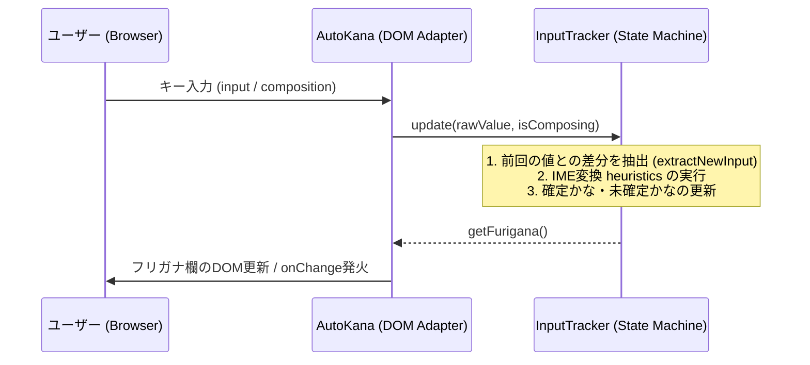

## この記事で分かること

- vanilla-autokana をフォークして半角カナに対応した理由
- IME入力中の未確定文字と確定文字を扱い分ける実装
- Vite 8 と TypeScript へ更新したパッケージの使い方

## クライアントサイドでのフリガナ自動入力における課題

日本のWebフォームにおけるフリガナ自動入力は、入力の手間を減らすための定番のUXデザインだ。
今なお jQuery 依存のライブラリが多く使われ続けているのが実態だ。

だが、モダンなフロントエンドでは依存関係のない軽量なライブラリが求められる。
この課題に対して、プレーンなJavaScriptで動作するライブラリとして「vanilla-autokana」が公開されていた。

ただ、長らくメンテナンスが滞っていたこともあり、モダンなプロジェクトで使うにはいくつかの課題があった。
具体的には、一部のフォームで依然として求められる半角カタカナの出力に対応していない点だ。

また、React や Vue などのコンポーネント指向フレームワークと組み合わせた際に、DOMの変更やフォーカス移動によってIMEの入力状態が乱れ、フリガナが重複する問題があった。
これらの課題を解決するため、ロジックを全面的にリファクタリングして新しいパッケージを公開することにした。

## 半角カタカナへのリアルタイム変換

日本のWebフォームでは、フリガナを半角カタカナで入力させる仕様が今なお多く残っている。
元のライブラリはひらがなと全角カタカナにしか対応しておらず、半角カタカナを求めるフォームに直接流し込むことができなかった。

そこで新バージョンでは、オプションに「katakana」を追加し、半角カタカナのリアルタイム変換をサポートした。
ひらがなから全角カタカナへの変換に加え、全角カタカナから半角カタカナへのマッピングテーブルを用意して文字を変換している。
「ガ」を「ｶﾞ」のように濁点と半濁点の2文字に分割する処理や、全角スペースを半角スペースに正規化する処理も組み込んだ。

```javascript
import { bind } from '@j1nn0/vanilla-autokana';

// 半角カタカナで出力する設定
bind('#name', '#furigana', { katakana: 'half' });
```

半角カタカナのサポートにより、従来はサーバーサイドで行う必要があった半角変換や、泥臭いDOMの書き換え処理をクライアントサイドで完結できるようになった。

## DOM操作から状態管理を分離する設計変更

設計上の最も大きな変更は、IMEの変換ロジックをDOM操作から切り離し、「InputTracker」というピュアな状態マシンとして抽出したことだ。

以前のコードはDOMイベントの監視とフリガナの推測ロジックが密結合しており、単体テストを書くためにはjsdom環境でイベントを擬似的に発火させる必要があった。
DOM依存のテストは可読性を下げ、不整合を発生させる原因になっていた。

新設計では、DOMの状態を監視して同期する役割を「AutoKana」が担い、純粋な入力文字列の差分からフリガナを推測する役割を「InputTracker」が担うように分離した。
全体のデータフローは以下のようになっている。



状態マシンの分離により、ブラウザ環境のシミュレーションを一切行わずに、文字列入力の遷移だけでフリガナの蓄積ロジックをテストできるようになった。
現在は Vitest を使用して、さまざまな文字入力パターンにおける状態遷移を網羅的にテストしている。

## 確定と未確定のかな状態を切り分ける2つの判定ルール

状態マシンの抽出に合わせて、フリガナの判定精度を向上させるためのヒューリスティクスを導入した。
キーボードの入力監視だけでは、漢字への変換（確定）のタイミングを捉えるのが困難だ。
そこで、入力中の「未確定かな」と「確定かな」を切り分けるために2つのルールを追加した。

■ 判定ルール
- 文字数の大幅な跳びを検知した場合
- 文字数は同じだが非かな文字（漢字など）が混入した場合

判定ルールに合致した瞬間に、未確定状態のフリガナを確定フリガナへ反映させる。
また、要素にフォーカスが当たった際、すでに入力されているフリガナと名前の値を吸い上げて状態を再同期する「resync」メソッドを実装した。
再同期（resync）を行うことで、初期値が入っているフォームや再レンダリングが発生した際にも、フリガナが重複して蓄積される不具合を防いでいる。

## Vite 8とTypeScriptによるエコシステムの刷新

コード品質の向上と快適な開発者体験を実現するため、開発ツールの選定も全面的に見直した。
ビルドシステムには Rolldown が標準搭載された Vite 8 を採用し、CJS（CommonJS）と ESM（ESModules）の両方を出力するデュアルパッケージ構成を高速にビルドできるようにした。
テストランナーは Jest から Vitest へ移行し、InputTracker の単体テストを高速に実行できる環境を整えた。

また、静的解析とフォーマッターには Rust 製の高速なツールである oxlint と oxfmt を導入した。
高速な静的解析とフォーマットにより、CI やローカルでのコード品質チェックがほぼ一瞬で完了するようになり、コード変更時のフィードバックサイクルを大幅に短縮できた。
パッケージマネージャーには pnpm v10 を採用し、依存関係の整理とインストールの高速化も図っている。

さらに、入力要素とフリガナ要素が連動する様子を視覚的に動作確認できるよう、Storybook も導入した。
オプションに応じた挙動の違い（ひらがな出力、全角カタカナ出力、半角カタカナ出力など）をカタログとして整理し、ブラウザ上で手軽に検証できる環境を構築した。

それと並行して、コードベース自体を JavaScript から TypeScript へ全面的に書き換えた。
型安全性の確保によって、複雑な入力追跡ロジックに明確な型定義が与えられ、安全に機能拡張ができる堅牢な基盤が整った。
利用者に対しても型定義ファイル（d.ts）を同梱して提供できるため、呼び出し時のコード補完やコンパイルエラー検知の恩恵を受けられる。

## 先人たちの成果と謝辞

このライブラリは、ryo-utsunomiya 氏の vanilla-autokana および harisenbon 氏の jquery-autokana をベースにして開発された。
jQuery なしでフリガナ入力補完を行うアイデアや、キー入力を監視してかなを推測する堅牢な実装基盤を築いてくれた先人たちの貢献に、心から感謝したい。

## パッケージの導入方法と利用開始

新しく公開したパッケージは、pnpm や npm を使ってプロジェクトに導入できる。

```sh
npm i @j1nn0/vanilla-autokana
```

パッケージの導入後、Vanilla JS はもちろんのこと、React や Vue などのモダンなフロントエンド環境でもすぐに利用できる。
今回はフォークという形をとったが、自分が使い倒す道具はやはり自分で面倒を見るのが一番手っ取り早いし、納得のいくものが作れたと感じている。
詳しい使用方法や統合例については、GitHub リポジトリを参照してほしい。

GitHubのリポジトリは https://github.com/j1nn0/vanilla-autokana から確認できる。
