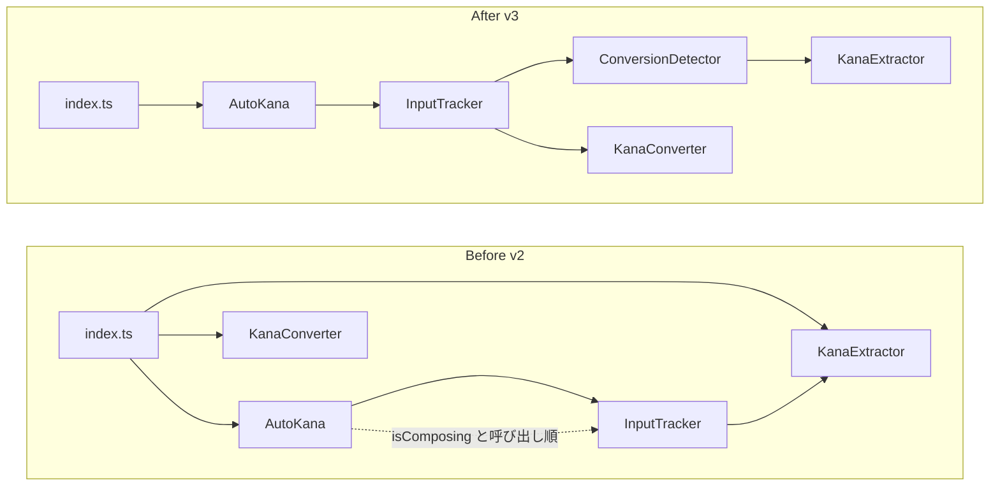

公開APIは、後から変えるたびにメジャーバージョンが必要になる。
READMEに書いていなくても同じだ。

vanilla-autokanaのv2は、READMEに書いていないものまで公開していた。
v3では、公開するAPIを絞り、内部の状態管理も整理した。
何を変えたかと、なぜその形になったかを書く。

## この記事で分かること

- 公開APIがサポート対象より広いと何が起きるか
- v3で公開APIをどう縮小し、内部をどう整理したか
- 選ばなかった選択肢と、AIエージェントでの進め方

## 公開APIはサポート対象より広かった

v2のエントリポイント(index.ts)は、bindとAutoKanaに加えてKanaConverterとKanaExtractorをexportしていた。
KanaConverterはかな文字列をひらがな・全角カタカナ・半角カタカナの間で変換する。
KanaExtractorは入力文字列からかなの部分を抜き出す。
どちらもふりがな生成の内部で使う部品で、利用者向けの説明はREADMEに書かれていなかった。

publicでmutableなoptionも問題だった。
option.katakana = 'full'と書くと型検査は通るが、実行時には何も起きない。
出力形式はコンストラクタでInputTrackerへコピーされていたからだ。
代入が効かないことに、コンパイル時には気づけない。
何も起きない代入は、コンパイルエラーよりたちが悪い。

processValueとsetFuriganaは@internalコメント付きのpublicメンバーだった。
型定義ファイルには載るし、呼べば動く。
コメントでinternalと書いても、実際にはpublicのままだった。

initializeValues()は非推奨のエイリアスだった。
READMEにはreset()を使えと書いてあったが、削除されずに残っていた。

## 公開APIは後から変えられない

v3の判断の理由を先に書く。

KanaConverterをexportしたままにすると、中身を変えるたびにメジャーバージョンが必要になる。
たとえばextractKanaの戻り値を文字配列から文字列に変えるだけでsemverが上がる。
使う人がいるかどうかも分からないのに。

テストのためのpublicメンバーも同じだ。
processValueをテストから直接呼んでいると、本番のイベント順序を飛ばしたテストが書ける。
テストで使う面と出荷する面がずれると、リファクタのたびに両方を直すことになる。
この原則を、ドキュメントではinterface disciplineと呼んだ。

## 公開面の変更

v3のbreaking changeを移行ガイドから整理する。

KatakanaOptionはv2の時点で'hiragana' | 'full' | 'half'に統一済みなので、v3の変更には含まれない。
KanaConverterとKanaExtractorはエントリポイントから削除した。
optionとisActiveは読み取り専用になり、実行時の変更はsetKatakana()だけになった。
initializeValues()は削除し、processValue()とsetFurigana()はprivateにした。

toggle()から引数が削除された。
チェックボックスのcheckedを渡すevent引数を廃止し、呼び出し側でevent.target.checkedに応じてstart()かstop()を呼ぶ。

ライフサイクルの扱いも明確にした。
stop()はDOM駆動の追跡だけを止める。
reset()とsetKatakana()は停止中も出力を更新する。
destroy()は何度呼んでも安全になった。
破棄後に状態を変えるメソッドはno-opで、getFurigana()とoptionは最後の値を返す。
reset()はふりがな出力(DOMとonChange)もクリアし、onChangeを発火する。

実行時の形式変更は、こうなる。

```javascript
// v2: コンパイルは通るが何も起きない
const ak = bind('#name', '#furigana', { katakana: 'half' });
ak.option.katakana = 'full';

// v3: 実行時に変更する唯一の方法
const ak = bind('#name', '#furigana', { katakana: 'half' });
ak.setKatakana('full');
```

setKatakanaは現在のふりがなも即座に再変換する。
追跡を止めていても実行される。
stop()が止めるのはDOMイベント駆動の追跡だけだからだ。

exportの縮小が守られているかはCIで検証する。
scripts/verify-package-exports.mjsが、エントリポイントがbindとAutoKanaだけであること、型定義のimportが解決すること、UMDのglobalが壊れていないことを確認する。
publintとattwも併用している。

## 内部面の変更

公開面を狭める一方で、内部も整理した。
前回の記事で書いたInputTracker抽出の続きだ。

v2のInputTrackerは、確定かなと未確定かなと変換ヒューリスティックを持っていた。
しかしcompositionの状態はAutoKana側に残っていた。
compositionendの後にはupdateを続けて呼ぶ必要があり、呼び出し順の知識がmoduleの外に漏れていた。
過去の不具合は、かな変換のロジックではなく、このイベント順序に集中している。

v3ではlifecycleをInputTracker内で完結させた。
DOM駆動の遷移は1つの型で表し、apply()で受け付ける。

```typescript
type InputTransition =
  | { type: 'blur' }
  | { type: 'focus'; raw: string; committedSeed?: string }
  | { type: 'compositionstart' }
  | { type: 'compositionend'; raw: string }
  | { type: 'input'; raw: string };

apply(transition: InputTransition): FuriganaResult
reset(): FuriganaResult
setKatakana(katakana: KatakanaOption): FuriganaResult
```

DOMアダプタは各イベントをInputTransitionへ写してapply()を1回呼ぶだけでよくなった。
5分岐のswitchはInputTracker側に移った。
apply()はFuriganaResultを返す。
{ furigana, notify }の形で、現在のふりがなと通知の要否を返す。
空入力の処理もtracker側に移り、adapterが順序を組み立てる必要がなくなった。

さらに変換検出をConversionDetectorとして抽出した。
isComposing、lastConvertedInput、lastNewInput、previousRawInputという追跡状態と、2つの変換ヒューリスティックがdetectorに移った。

compactKanaはdetectorへ移った。
containsNonKanaはテスト専用のseamだったので削除し、KanaExtractorのcontainsUnsupportedKanaに置き換えた。
「かな抽出」という名前のmoduleに「変換検出」のヘルパがあったのは、役割の境界が崩れていた。



もう一つ、状態をひらがなに統一した。
InputTrackerの状態は常にひらがなで持ち、出力形式はフォーマット時にだけ適用する。
形式を途中で変えても状態は変わらない。
出力形式のリテラル型はフォーク時に導入済みで、v3で加えたのは形式と状態の分離だ。

AutoKanaも、DOMイベントを遷移へ写す入力アダプタをクラスとして分離した。
AutoKanaは要素の解決と出力の通知だけを担う。

## テスト面の変化

この二つの抽出で、最もリスクの高い分岐が文字列単体でテストできるようになった。

v2では変換検出のフォールバック分岐に到達するには、長いIMEイベント列を組む必要があった。
ConversionDetector.test.tsでは、生の文字列で直接ヒューリスティックを検査できる。

AutoKana.test.tsは1417行から620行へ縮小した。
ConversionDetector.test.tsは新設し、InputTracker.test.tsは遷移の振る舞いに絞って書き直した。
IMEシナリオはime-scenario.tsで共有し、同じイベント順序をDOMと状態機械の両方で再生できる。

CIはlint、typecheck、127テスト、coverage、ビルド、verify:exports、publint、attwを通している。
DOMイベントのテストは減らしたが、イベント順序の不具合はAutoKana.ime.test.tsとシナリオテストで防いでいる。

## 選ばなかった選択肢

利便性のためのpublic維持もやめた。
mutableなfieldや@internalは「便利だから」と残すと、何も起きない代入や型の漏れが続く。
コンパイルエラーで気づける形を選んだ。

純関数での抽出も選ばなかった。
変換検出を状態なしの関数群にすると、リセットの順序を保つ責任がInputTrackerに残る。
複雑さが移動するだけで減らない。

adapter interfaceの追加も見送った。
実際のadapterはAutoKana一つだけなので、切り替え用のinterfaceは作らなかった。

exportを残しておく案もやめた。
「使う人がいるかも」は公開APIを増やす理由にならない。
単体の変換が必要なら専用ライブラリに分離できる。

## AIエージェントでの進め方

この作業はAIエージェントと一緒に進めた。
記録が残っているので、進め方を参考までに書く。

まずアーキテクチャレビューに、mattpocock氏が公開しているimprove-codebase-architectureスキルを使った。

[improve-codebase-architecture](https://github.com/mattpocock/skills/blob/main/skills/engineering/improve-codebase-architecture/SKILL.md)

このスキルは、codebase-designの語彙(module、seam、depth、deletion test)で候補を洗い出し、grillingのループで決定を一つずつ確定する流れになっている。
自分でgrillingを明示的に実行したわけではなく、スキルのフローに組み込まれている。

「InputTrackerを消したら複雑さはAutoKanaに戻るだけだ」というdeletion testが、抽出の判断根拠になった。
ConversionDetectorの抽出は、seamの形、責務の範囲、命名、interface、ヘルパの置き場所、テスト範囲の6問に分けて決めた。

その後もレビュー指摘を潰すセッションを2回追加した。
中継ぎのイベントハンドラ、使われていないDSLの表面、古いJSDoc、置き場所の間違ったテスト、検証できないstoryのアサーションが対象だった。
InputTrackerのinterfaceは、この過程で6つの遷移メソッドからapply()1本へ統合された。
このときtoggle()のevent引数も削除した。

最後にponytail-auditを3回回した。
ponytailはdietrichgebert氏が公開しているスキルで、今回初めて導入した。

[ponytail](https://github.com/dietrichgebert/ponytail)

1回目はテストのraw InputEvent配線33箇所を共有ヘルパへ置き換えて、AutoKana.test.tsが846行から731行になった。
3回目で新しい切り込みは見つからなくなった。

監査の指摘が全部正しかったわけではない。
「@types/typescript6はdead weight」という指摘は誤認で、TypeScript 7でunplugin-dtsが要求するフォールバックだった。
すぐ撤回して復元した。
AIの指摘を盲信しないという教訓を、安く学べた。

## まとめ

v3は、公開するAPIを絞り、内部はリスクの高いロジックを直接テストできる形にした。

公開APIは、増やした分だけ後から変えられなくなる。
READMEに書いたものだけを公開し、テストの都合を型に漏らさない。
interface disciplineという名前のこの原則は、ライブラリを公開している人ならどこでも使える。

移行ガイドはREADMEにまとめた。
https://github.com/j1nn0/vanilla-autokana

v3はリリース済みで、npmから@j1nn0/vanilla-autokana@3で導入できる。
前回の記事で紹介したbind()の使い方は変わらない。
