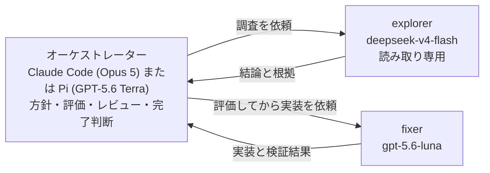

約6週間放置していたライブラリを、1日で v1.0.0 まで持っていった。

Vue 3 のモーダルダイアログライブラリ [vue-modal-dialog](https://github.com/j1nn0/vue-modal-dialog) は、7月1日の v0.13.5 を最後に放置していた。8月13日、1日で rc を11回重ねて v1.0.0 を出した。この日に入れた破壊的変更は6件。

作業は [`agent-orchestration`](https://github.com/j1nn0/skills) スキルの3エージェント構成で回した。オーケストレーターには Claude Code(Opus 5)と Pi(GPT-5.6 Terra)を使い分けた。前半は Opus 5、中盤は GPT-5.6 Terra、そして後半は Opus 5 に戻した。Terra では解決できない問題にぶつかったからだ。それは公開された型定義だけが壊れるという問題で、ローカルのテストは全部通っていた。

オーケストレーターをフェーズで使い分けた判断と、いつ強いモデルに戻すかの基準を、実際の rc の記録とともに書く。

## 3エージェント構成とモデル割当

agent-orchestration スキルは作業を3つの役割に分ける。オーケストレーターが方針の決定、調査結果の評価、実装のレビュー、完了の判断を担当し、委譲するのは調査と実装だけだ。

- オーケストレーター: エージェントもモデルも固定しない。今回は Claude Code(Opus 5)と Pi(GPT-5.6 Terra)を使い分けた
- explorer: 調査と研究。読み取り専用。モデルは `opencode-go/deepseek-v4-flash`(thinking: max)
- fixer: 実装。モデルは `openai-codex/gpt-5.6-luna`(thinking: max)

調査結果はオーケストレーターが評価してから実装指示に変換する。explorer の仮説をそのまま fixer に渡さない。レビューも完了判断もオーケストレーターが手放さない。スキルの設計と、委譲先を pi に統一した経緯は前の2記事に書いた([スキルの設計]()、[委譲先の pi 統一]())。ここでは実戦での使い方を書く。

## 前半: 方針は Opus 5。公開 API を全部見直す

v1.0.0 は最初の安定版で、破壊的変更を入れられる最後の機会でもある。破壊的変更への躊躇は一切なかった。エージェントにレビューや改善提案をさせる際にも、破壊的変更を許容すると指示していた。まずやったのは、0.x の間に溜まった妥協の見直しだった。rc.1 で入れた破壊的変更は4件。

- **a11y**: ダイアログのアクセシブルネームを header でなく title 要素から導出。`aria-describedby` は自動生成しない
- **useDialog**: `open()` が Promise を返す imperative マウント API に。README の説明と実装が食い違っていたのを、実装に合わせて直した
- **events**: `opened` は DOM 更新後に発火。こちらもドキュメント化されていた順序と実装が食い違っていた
- **backdrop**: `backdrop: false` なら要素自体を描画しない。外部クリックでの close は backdrop 上のクリック完了のみ

このフェーズは Claude Code(Opus 5)が担当した。判断がそのまま公開 API になる作業で、間違いのコストが高いため、一番強いモデルを当てた。

この使い分けはコミット履歴にも残っている。この日、Opus 5 が担当したコミットには `Co-Authored-By: Claude Opus 5` の記録が付き、中盤のコミットには付いていない。フェーズの切替は、どちらのモデルが書いたか分かる形で記録された。

## 中盤: 反復は GPT-5.6 Terra。rc を重ねて直す

rc.1 以降は、見つかった問題を直しては rc を重ねるループになる。ここでオーケストレーターを Pi(GPT-5.6 Terra) に切り替えた。修正の内容はこうだ。

| rc | 直したこと |
| --- | --- |
| rc.2 | 最初から開いているダイアログ、leave transition の待機、ESM/CJS 両対応 |
| rc.3 | publish のゲート、即時 close |
| rc.4 | タグのソース保持、dist-tags の安定化 |
| rc.5 | モーダル専用化(破壊的変更) |
| rc.6 | a11y と closing の強化(破壊的変更) |
| rc.7 | close リクエストの重複防止 |
| rc.8 | Vite 設定の JSON import attribute、Storybook の掃除 |

反復の途中で、破壊的変更がさらに2件入っている(rc.5、rc.6)。レビューや改善提案に破壊的変更を許容していたので、仕様としておかしい場所を見つけたら、迷わず v1.0.0 のうちに直してしまう。

ループの回し方は、スキルに書かれたままだった。fixer への指示は毎回 `/new` で独立させ、実装と検証結果はオーケストレーターが自分で diff とテストを確認する。

ループにはもう1つ、スキルにない工程を足していた。rc をリリースするたびに、ChatGPT(GPT-5.6 Sol)にレビューさせる。オーケストレーターのレビューが方針と diff を見るのに対し、こちらは公開物の観点で問題を探す。

修正がループするほど、学んだことはリポジトリに残っていく。

## 後半: Terra が解けなかった型問題を、Opus 5 に戻して解く

山場は rc.8 の後だった。公開型が壊れていた。しかもローカルでは何も壊れていなかった。見つけたのは、rc を重ねるたびに回していた ChatGPT(GPT-5.6 Sol)のレビューだった。

このライブラリの props は `VueModalDialogCommonProps & DialogRoleProps` という intersection 型で、role は `'dialog' | 'alertdialog'` の union を含む。この型を `withDefaults()` で包むと、vue-tsc が宣言の推論を静かに諦め、`DefineSetupFnComponent<Record<string, any>, {}, ...>` を吐く。ランタイムの props は正しいままなので、開発中は何も気づかない。壊れるのは公開された `dist/index.d.ts` だけだ。

つまり、このパッケージをインストールしたユーザーは、prop も emit も slot も v-model の型チェックを失う。ローカルのテストは全部通る。開発のループの中では誰も気づかない。

Terra はこの問題を解決できなかった。原因の切り分けに進めず、修正の見通しが立たない状態が続いた。ここでオーケストレーターを Opus 5 に戻すと、短時間で修正が入った。

修正は2段構えだった。

1つ目はコードの修正。`withDefaults()` をやめ、reactive props の分割代入でデフォルト値を与える形に変えた。

2つ目は再発防止だ。この手の「ローカルでは壊れない」問題は目視では見つからない。[`scripts/check-packed-types.sh`](https://github.com/j1nn0/vue-modal-dialog/blob/main/scripts/check-packed-types.sh) を作り、CI に組み込んだ。このスクリプトはパッケージを pack して一時ディレクトリに consumer プロジェクトを作り、vue-tsc で2つの検査をする。

- 正しい使い方(存在する prop と slot)が型チェックを通ること
- 間違った使い方(`widthh` のような存在しない prop、`#nonexistent` の slot)が型エラーになること

後者の反例検査が本質だ。これがないと、型が `any` に化けた状態でも検査が通ってしまう。rc.9 の失敗は、まさにこの形だった。

この一連の教訓は、リポジトリの [AGENTS.md](https://github.com/j1nn0/vue-modal-dialog/blob/main/AGENTS.md) に ANTI-PATTERNS として記録された。「`withDefaults()` で包まない。intersection に union を含む型では vue-tsc が宣言推論を諦め、公開される `dist/index.d.ts` だけが壊れる」。理由ごと。次のセッションのエージェントが同じ罠に落ちないための記録だ。

## 教訓: フェーズで切り替える判断基準

オーケストレーターを使い分けたのは、モデルの性能差というより、フェーズの性質に合わせた割り当てだった。

- **方針を決めるフェーズ**は強いモデルで。公開 API の見直し、破壊的変更の判断は間違いのコストが高い
- **反復修正のフェーズ**は安いモデルで。トライアルの回数が多く、コスト感度が高い
- **反復が進まなくなったら、強いモデルに戻す。粘らない**

3つ目が一番重要で、一番難しい。

Terra の修正が詰まったのは、型問題だけが原因ではない。反復が進むにつれて、問題の性質が「既知のパターンで直せるもの」から「前提から疑わないといけないもの」に変わっていった。型問題はその典型で、ローカルのテストが全部通るのに公開型だけが壊れている状況は、調査なしでは切り分けられない。

そもそもこの問題を見つけられたのは、rc ごとの独立したレビューがあったからだ。テストも実装者も通らない問題は、別系統の目で公開物を見ることで初めて見える。

「解決の進捗が止まったら、同じモデルで粘らない」。粘ると、場当たりの修正が積み上がる。この1日で学んだことの多くは、AGENTS.md の ANTI-PATTERNS と scripts/ に残った。型問題のほかにも、`engines` に開発環境の要件を書かない(公開パッケージの消費者を縛るから、開発側の検査は `check-dev-env.mjs` に分離する)という教訓が rc.11 で記録されている。エージェントの失敗が、次のセッションの知識ベースになる。

## 結び

この構成は試せる。スキルとライブラリはどちらも公開している。結果が同じになる保証はないが、少なくとも同じ道具で同じ作業を始めることはできる。

- [`agent-orchestration` スキル](https://github.com/j1nn0/skills)
- [vue-modal-dialog](https://github.com/j1nn0/vue-modal-dialog)。npm は [`@j1nn0/vue-modal-dialog`](https://www.npmjs.com/package/@j1nn0/vue-modal-dialog)

試すなら、まず自分のプロジェクトでオーケストレーターを固定しないことから始めるといい。反復が止まったらモデルを上げる、を1回試すのが最短の入り口だ。
