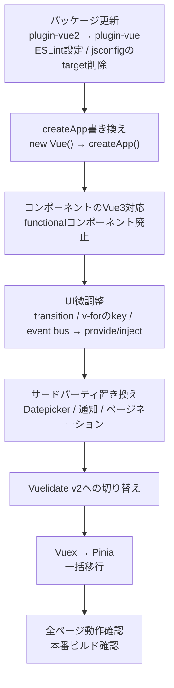

1年ほど前に、6年運用してきた業務SaaSのVueを、2.7を経由して3.5まで引き上げた。
VuexはPiniaへ一括で移行し、日付ピッカーや通知、バリデーションといった周辺ライブラリも入れ替えた。

それでもTypeScriptは入れていない。
Vue 3にするならTypeScriptも一緒に入れるべきという意見はよく見かけるが、今回はその流れに乗らなかった。
移行そのものを完走させることを優先し、同時に変える範囲を絞った。

## この記事で分かること

- Vue 2.7を経由し、Vite移行を先に済ませてから3.5へ上げた理由
- VuexからPinia、Vuelidateから2段階でRegleへといった、周辺ライブラリの置き換え方
- Vue 3移行と同時にTypeScriptを入れなかった理由と、そこにある判断基準

## 移行前の規模感

対象は、PHP(Laravel)のバックエンドとVueのフロントエンドを持つマルチテナントSaaSだ。
開発環境の構成は[以前の記事]()でも触れた。
2020年3月から開発を続けていて、コミット数は4,405、コントリビューターは延べ7人、現在の担当は自分1人になっている。

| 指標 | 値 |
| --- | --- |
| PHPファイル数 | 419 |
| PHP総行数 | 約68,800行 |
| Vue/JS総行数 | 約134,600行 |
| Controller | 49 |
| Service | 158 |
| Model | 52 |
| DBテーブル数 | 59 |
| ルート数 | 244エンドポイント |
| Vueコンポーネント数 | 89 |
| テストファイル数 | 148 |
| ジョブ(非同期処理) | 17 |

Service数がControllerの約3.2倍あり、業務ロジックの厚みがうかがえる。
Vue/JSの行数はPHPの約2倍で、フロントエンドの方が大きい。
DBテーブル数は59、チーム規模は最大でも7人なので、エンタープライズ級の大規模開発ではない。
それでも6年間触り続けてきた分、あちこちに歴史が積もっている。
「大規模」でも「小規模」でもなく、中規模の業務SaaSと呼ぶのが実態に近い。

## Vue 2.7を経由した理由

Vue 2から3への移行は破壊的変更を伴い、工数が大きい。
機能開発を止めてまで一気にやる判断はできず、他の仕様変更対応を優先してきた。

その間、何もしていなかったわけではない。
Vue 2.7はOptions APIとVue 2のランタイムを保ったまま、Composition APIをバックポートしたバージョンだ。
3への移行を先送りしている間に、ビルドツールをvue-cliからViteへ切り替える作業を先に終わらせておいた。

このとき使ったプラグインは`@vitejs/plugin-vue2`で、Vue自体はまだ2系のままだった。
フレームワーク本体とビルドツールという2つの大きな変更を同時に転がさず、先にビルドツールだけを片づけておいたことになる。
3.5への移行に着手したとき、変えるべき変数はフレームワーク本体に絞れていた。

周辺ライブラリの選定でも、同じ考え方を先取りしていた。
2.7の間から、Vue 2と3の両方をサポートしている、またはバージョンごとの対応版があるライブラリを意識して選んでいた。
3.5へ上げる段階でコード変更が不要なものと、メジャーバージョンを上げるだけで済むものとに分けておき、書き換えが必要な箇所を絞り込む狙いだ。

具体的には、`vue-clipboard2`をVueUseの`useClipboard`に、`vue-media-query-mixin`をVueUseの`useBreakpoints`に、それぞれ2.7の時点で置き換えておいた。
機能ごとに個別のライブラリへ依存する代わりにVueUseへ寄せておいたことで、のちにVueUse自体をVue 3対応版へ上げる際もメジャーバージョンを上げるだけで済んだ。
複数選択の`@vueform/multiselect`も、Vue 2.7と3.5の両方をサポートしているライブラリとして2.7の時点で選んでおいたので、3.5移行時は最小限の変更で済んでいる。

## 移行の実際の手順

3.5への移行では、まず「ビルドが通る状態」を最優先にした。

`vue-template-compiler`を削除し、ESLintの設定を`flat/vue2-essential`から`flat/vue-essential`へ、`jsconfig.json`から`target: 2.7`を削除するところから始めた。
土台が整った状態で`new Vue()`を`createApp()`に書き換え、89コンポーネントをひとつずつVue 3形式へ直していった。
その後にtransitionクラスやv-forのkey属性といった見た目に影響する差分を潰し、サードパーティライブラリとバリデーション、最後にVuexをPiniaへ移した。

最初にビルドを通す、次に動作確認しやすい単位から潰す、という順番にしたことで、途中経過でも「今どこまで進んでいるか」を把握しやすかった。
複雑なUIやバリデーションを後回しにしたのも、確認に時間がかかる部分を移行の終盤に寄せる判断だ。

ダイアグラムに載る大きな工程だけでは終わらなかった。
エラーハンドラーの修理やHTTPクライアントまわりの修正など、細かい対応も実際には随所で発生している。
全体の見取り図は前段のとおりだが、実際の移行はこうした小さな修正の積み重ねでもあった。

## Vuexからは一括でPiniaへ

Vuexは段階的に移行せず、一括でPiniaに置き換えた。
コンポーネントのVue 3対応やOptions APIの扱いを段階的に進めた一方で、状態管理は一度に切り替えている。
同じ移行の中でも、対象によって踏み込み方を変えた形だ。

## 周辺ライブラリの置き換え

サードパーティライブラリは、Vue 3対応版が出ているものへ入れ替えた。

| 用途 | Before | After |
| --- | --- | --- |
| 日付・時刻ピッカー | vuejs-datepicker / vue2-timepicker | @vuepic/vue-datepicker(1つに統合) |
| 通知 | vue-notification | @kyvg/vue3-notification |
| ページネーション | vuejs-paginate | vuejs-paginate-next |

バリデーションだけは、他と違う進め方をした。
Vue 2時代に使っていたVuelidate v0.7.7を、3.5への移行のタイミングでは同じVuelidateのv2(Vue 3対応版)へ置き換えるだけにとどめた。
[Regle](https://reglejs.dev/)へ移り変えたのは、それからしばらく経ってからだ。

Regleを選んだ理由は、Vuelidate自体の開発が止まっていて、このままでは将来また同じ置き換え作業が発生すると分かっていたからだ。
ただし、それを3.5移行と同時にはやらなかった。
移行の最中に「動くようにする変更」と「作り直す変更」を混ぜると、どちらかで問題が起きたときに原因を切り分けにくくなる。
まずVuelidate v2でフォームごとの書き換えを最小限に抑えて移行を完走させ、Regleへの本格的な置き換えは後日、移行のリスクが片づいた状態で着手した。

## Options APIを一気に捨てなかった理由

3.5移行の時点で、コンポーネントの書き方をComposition APIへ揃えることも選択肢にはあった。
だが、動いているものはなるべく壊したくなかった。
Composition APIへの移行はコンポーネントごとの書き換えになり、UIの細かな挙動まで確認が必要になる。
フレームワーク本体の移行と同時にやると、不具合が出たときにどちらが原因か分からなくなるリスクがあった。

そこで、Composition APIへの移行は「必要になったコンポーネントから段階的に」という方針にした。
今の時点で、Options APIのまま残っているコンポーネントは全体の6割ほどある。
ペースは決して速くないが、今もこの方針で少しずつComposition APIへの移行を進めている。

## TypeScriptを同時に入れなかった理由

Vue 3にするならTypeScriptも、という意見はよく見かける。
Composition APIとTypeScriptの相性がよく、`defineComponent`や`<script setup lang="ts">`が前提のドキュメントも多い。
一般論としては理解しているし、いずれ検討したい気持ちもある。

それでも今回は見送った。
理由は3つ、型定義コスト、チームのTypeScript習熟度、影響範囲の大きさだ。

Vue/JSだけで約134,600行、コンポーネント数は89ある。
これを型なしのまま3.5へ移すだけでも変更差分は大きい。
そこにTypeScriptへの書き換えまで重ねると、1回の移行で動かす変数がさらに増える。
コンパイルは通るのに実行時に壊れる、という一番厄介な種類の不具合を、規模の大きいコードベースの全域で拾うことになりかねない。

チームは最大でも7人、現在は自分1人でこのSaaSを見ている。
型定義を書く工数も、レビューする体制も、フレームワーク移行と並行して確保できる規模ではなかった。
TypeScriptを入れること自体に反対しているわけではない。
今この移行に乗せるべき変更ではない、という判断だ。

## 移行と改善を同時にやりすぎない

ここまでの判断を並べると、共通する基準が見えてくる。

- Vite移行は、Vue 3本体の移行より先に、2.7の間に済ませておいた
- Vuelidateは、Vue 3対応の最小限の置き換え(v2)を先にやり、作り直し(Regle)は後回しにした
- Composition APIへの統一は、移行と同時にはやらず、必要な箇所から段階的に進めている
- TypeScript導入は、今回の移行の範囲そのものから外した

どれも「動くようにする変更」と「良くする変更」を同じタイミングでやらない、という同じ判断だ。
移行中に同時に動かす変数が増えるほど、不具合が起きたときの原因の切り分けは難しくなる。
長く運用している業務アプリほど、この切り分けにかかる時間がそのまま止まる時間になる。

Vue 3への移行そのものは、破壊的変更を含む以上いずれ避けられない。
その避けられない変更に、避けられる変更を無理に乗せないことが、完走のための判断だったと思う。

## 移行後に残っている課題

正直に書くと、移行を終えてから1年ほど経つが、型がないことで開発に直接困ったことはない。
Composition APIへの統一も、必要になったコンポーネントから少しずつ進めている最中で、急ぐ理由もない。

TypeScriptについては、最近になって別の角度から必要性を感じ始めている。
AIエージェントを使うようになって、有名な「スキル」の多くがTypeScriptを前提にしていると気づいたからだ。
今のところは、スキルからTypeScript前提の部分を削って使っている。

フレームワーク移行のためにTypeScriptを入れる理由はなかった。
だが、AIエージェントのエコシステムに合わせるためという理由なら、いずれ話は変わってくるかもしれない。
