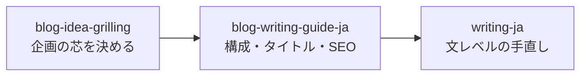

[前回の記事](/posts/hallmark-blog-redesign/)で、AIが書く日本語の定型的な言い回しを`writing-ja`というAgent Skillで直していると書いた。
このスキルは7月7日に作り、10日後の7月17日に中身を作り直している。
最初の版と今の版では、文章の直し方がまったく違う。

最初の版は、禁止する表現を並べたリストだった。
今の版は、文章の内容を事実・推測・判断の3種類に分け、原文にない経験や感情を作らせない編集の型になっている。
何をどう変えたのかを書く。

## 3つの日本語執筆ルールを1つにまとめようとして始まった

`writing-ja`を作る前は、自分の技術記事を直すのに`japanese-tech-writing`、`human-writing-ja`、`humanizer-ja`という3つの日本語執筆ルールを手元で使い分けていた。
ルール同士は方針が食い違う。
太字は用語の初出だけ使ってよいというルールもあれば、全面禁止というルールもある。
毎回どちらを採るか自分で判断するのが面倒になり、1つのスキルにまとめることにした。

まとめる基準には、それまでに公開していた自分の記事の実際の書き方を使い、記事の実態と食い違うほうのルールを削った。
太字は本文で使っていなかったので禁止に倒し、体験や所感は記事の核になっていたので残した。

統合の候補には`human-writing-ja`もあった。
ただしライセンス表記を確認できなかったため、このスキルへの取り込みは見送った。
`humanizer-ja`とk16shikano氏の公開Gistは、ライセンスを確認したうえで取り込んだ。
`humanizer-ja`はMITライセンスで公開されている。
元は`blader/humanizer`というGitHubリポジトリで、その日本語版を`gonta223/humanizer-ja`が公開している。
Gistは著作権表示の保持を求めないThe Unlicenseだった。
`SOURCES.md`と`LICENSE`に出典と変更範囲を書き、Unlicenseの分はコピーライト表記が不要な旨も明記した。

## 最初の版は、禁止する表現の一覧だった

書式のルールと「AI臭の除去」という表を中心に組んでいた。

> 「重要なのは〜である」「本記事では〜を解説します」「まとめると」
> 「浮き彫りにしており」「今後の展開が注目されます」「注目に値する」
> 「不可欠」「核心的」「鍵となる」「画期的」「多角的」「包括的」

表に載っていない言い回しも見つけ次第このリストに足していけば、直すべき表現を網羅できると考えていた。
仕上げの検証も、この考え方をそのまま引き継いでいた。
`——`や`**`、行末のコロンをgrepで検索し、0件になるまで機械的に置き換える手順にしていた。

## 表現を禁止するだけでは、正確さも自分の言葉も残らなかった

このリストを実際の記事の手直しで使い続けるうちに、表にある言い回しを消しても、文章がそのまま良くなるわけではないと感じるようになった。
言い換え先の候補まではリストが教えてくれない。
結果として、別の紋切り型の表現に置き換わるだけのことがあった。
もっと直すべきなのは、根拠のない断定や、書いていない経験を書いたように見せる書き方のほうだった。
表現の禁止は、そこには手が届かない。

7月17日、この考え方を変えた。
書式の禁止リストと表をほぼ全部外し、文章の内容を事実・推測・判断の3種類に分けて扱う編集の型に書き直した。

| 種類 | 内容 |
| --- | --- |
| 事実 | 観測結果、仕様、引用できる資料、実施済みの作業 |
| 推測 | 条件付きの見通し、未確認の原因、再現できていない説明 |
| 判断 | 書き手の選択、評価、好み、方針 |

この型ではまず、「書き手が示していない出来事、感情、利用経験、比較結果を追加しない」という境界を置く。
そのうえで、事実は出所や条件を失わないように整え、推測は断定に変えず、判断は書き手が実際に述べたものだけを残す。
`references/examples.md`には、この型に沿った実際の書き換え例を置いている。

変更前:

> M4の処理性能には今のところ不満がない。

変更後:

> 2026年7月時点では、M4の処理性能に不満はない。

「今のところ」だけでは、いつの観測かが残らない。
仕様と書き手の観測が一文に混ざっている場合も同様に分ける。

変更前:

> GhosttyはGPUアクセラレーション対応で起動と描画が速く、設定ファイルがシンプルで、必要な設定が数行で済む。

変更後:

> GhosttyはGPUアクセラレーションに対応している。自分の環境では起動と描画が速く感じるし、設定ファイルもシンプルで必要な設定は数行で済む。

製品の仕様と自分の環境での体感を、同じ文の中で同じ確かさのまま書かない。
どちらの例も、表現を禁止したのではなく、事実と判断の境界を文の中に引き直しただけである。

## 企画・構成・文章の3段階にスキルを分けた

`writing-ja`を作り直したのと前後して、記事作りの工程も1つのスキルに詰め込まず、3段階に分けた。

`blog-idea-grilling`は記事の芯(読者・主張・扱う範囲)を固める。
`blog-writing-guide-ja`は構成・タイトル・見出し・SEOを担当し、`writing-ja`は文レベルの手直しだけを担当する。

`blog-idea-grilling`は、mattpocock/skillsが公開している`grilling`(`grill-me`)というスキルを土台にしている。
一般的な計画を問い詰める元のスキルを、記事の企画を固める用途に絞り直した。
下書きはFable 5に作らせ、MITライセンスの表記と変更範囲を確認してから取り込んだ。

`blog-writing-guide-ja`自体も、getsentry/skillsが公開している`blog-writing-guide`をApache-2.0のもとで翻訳・再構成して作った。
こちらの下書きもFable 5に作らせ、Apache-2.0の表記と変更範囲を確認してから取り込んだ。
記事の書き方を定めるスキルどうしでも、出典の扱いと下書きの作り方は同じ基準で揃えている。

どちらも記事本文には直接触れる`blog-ops`という入口スキルの配下に置き、新規記事のセットアップやタグ管理、公開前チェックは`blog-ops`側の役割にした。
1つのスキルに企画から文体まで詰め込むと、依頼のたびにどの規則が効いているか把握しづらくなるため、役割を分けた。

## 長いプロンプトではなく、保守できるAgent Skillにする

事実・推測・判断の型に書き直した後も、`writing-ja`には定型的な言い回しの候補を機械的に洗い出す`scripts/check_style.py`を残している。
このスクリプトは、内容のない予告や根拠のない結論の強調、抽象的な宣伝語、emダッシュ、太字、行末のコロンなどを候補として報告する。
ただし結果はWARNであり、機械的に置換はしない。
文脈を見て判断するのは書き手の役割にしている。

スキルの`description`が意図どおりのタイミングで発火するかも、`evals/trigger/`にshould-trigger・should-not-triggerのテストセットを置いて確認している。
`description`を変更する前にこのテストセットを見直し、Codexの評価器でも検証する運用にした。
front matterの検証やスクリプトの単体テストは`tests/`に置き、GitHub Actionsでも同じテストを実行している。

これらは、規則を1つの長いプロンプトに書き足していく方法を避けるための構成である。
規則、機械検査、改稿例、発火判定のテストをそれぞれ別のファイルに分けておけば、どれか1つを直すときに他の部分を読み直さずに済む。

## 今もこの型で自分の記事を直している

この記事自体も、`blog-idea-grilling`で主張と扱う範囲を固め、`blog-writing-guide-ja`で構成を作り、`writing-ja`で文章を直すという手順で書いた。
禁止語リストをやめたことで、AIが書いたと感じる箇所が完全になくなったとまでは確認していない。
今言えるのは、リストにない言い回しが出てくるたびにルールを1行足す運用より、事実・推測・判断の境界を確認する運用のほうが、自分の記事の手直しでは続けやすいということだけである。

スキルの中身は公開している。



`writing-ja`のディレクトリには`SKILL.md`のほかに`SOURCES.md`、`LICENSE`、`references/examples.md`、`scripts/check_style.py`が並んでいる。
