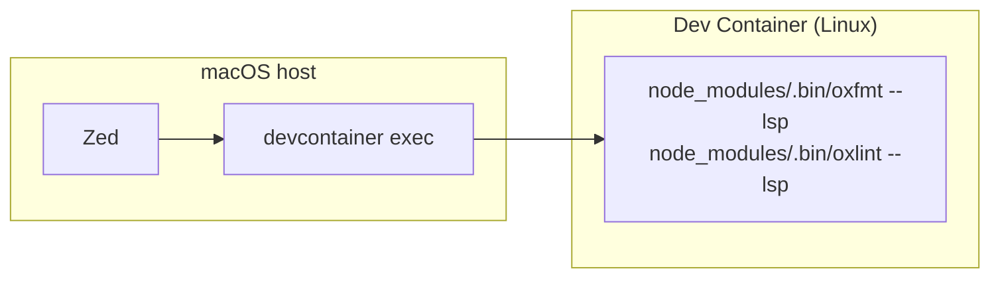

## この記事で分かること

- Zed本体とLSP拡張はホストで動き、Dev Container内のランタイムとは実行場所が分かれるという前提
- `devcontainer exec` をZedの `lsp.<name>.binary.path` に書くときにハマりやすい2つの間違い
- 最終的にたどり着いた設定(settings.json)と、oxfmt・oxlint・vtslsの役割分担

oxfmtは、VSCodeを使っていた頃からプロジェクトに導入していた。
エディタをZedに移行したタイミングで、フォーマッタの設定もZed側に書き直すことになった。
設定を移し替えただけのつもりだったが、保存してもフォーマットがかからなかった。

Zedのログには、こう出ていた。

```text
Language server oxfmt:

failed to spawn command Command { program: "/Users/j1nn0/.local/share/mise/installs/npm-devcontainers-cli/latest/bin/devcontainer exec node_modules/.bin/oxfmt", args: ["--lsp"], ... }: No such file or directory (os error 2)
```

`No such file or directory`。パスは合っているはずなのに、なぜ見つからないのか。

## 1つ目の壁: コマンドライン全体を1本の文字列に詰め込んでいた

PHPやNode.jsのランタイムはDev Container内にあり、Zed本体と拡張機能はmacOS側で動いている。
プロジェクトの `node_modules/.bin/oxfmt` はコンテナ内でインストールされたLinux用バイナリなので、macOS側のZedから直接呼んでも動かない。

そこで最初に思いついたのが、`devcontainer exec` を経由させることだった。
[前回の記事](/posts/ai-agent-devcontainer-exec/)で、AIエージェントからDev Container内のPHPやNode.jsを実行するのに使っていたのと同じ方法だ。

Zedの `lsp.<name>.binary.path` に、`devcontainer exec node_modules/.bin/oxfmt` という文字列をそのまま書いてみた。
これがそもそもの間違いだった。

上のエラーログをよく見ると、`program` の値が `"...devcontainer exec node_modules/.bin/oxfmt"` という1本の文字列になっている。
Zedはこの値をシェル経由で解釈しない。空白を含んだこの文字列をまるごと、実行ファイルのパスとして探しにいく。
そんな名前のファイルは存在しないので、`No such file or directory` になる。

シェルのコマンドラインをそのまま貼り付けられる設定ではなかった。
`binary.path` には実行ファイル1つのパスだけを書き、追加の引数は `arguments` に配列で渡す必要がある。

## 2つ目の壁: pathとargumentsを分けても、設定ファイルが読まれていなかった

`path` を `devcontainer` の実行ファイル自体に直し、`arguments` に `exec`、`node_modules/.bin/oxfmt`、`--lsp` を並べた。

```jsonc
"binary": {
  "arguments": ["exec", "node_modules/.bin/oxfmt", "--lsp"],
  "path": "/Users/j1nn0/.local/share/mise/installs/npm-devcontainers-cli/latest/bin/devcontainer"
}
```

`No such file or directory` は消え、保存時にフォーマットが走るようになった。
ただし、フォーマットのされ方がおかしかった。
プロジェクトの `.oxfmtrc.json` に書いたルールが反映されず、oxfmtのデフォルトルールでフォーマットされていた。
エラーにはならないぶん、しばらく気づかなかった。

原因は `initialization_options` の `fmt.configPath` を `null` のままにしていたことだった。
`devcontainer exec` 経由で起動したときのワーキングディレクトリは、Zedが想定しているホスト側のプロジェクトルートとは一致しない。
相対パスや `null` のままでは、コンテナ側のどこを基準に `.oxfmtrc.json` を探せばいいのか解決できていなかった。

`fmt.configPath` に、コンテナ内での絶対パスをそのまま書いた。

```jsonc
"initialization_options": {
  "settings": {
    "fmt.configPath": "/var/www/html/.oxfmtrc.json",
    "run": "onSave"
  }
}
```

これで、プロジェクトのルールどおりにフォーマットされるようになった。

## 最終的な設定

`path` と `arguments` を分け、`configPath` を絶対パスで明示する。
oxlintも同じパターンで `devcontainer exec` 越しに変えた。



settings.jsonの該当箇所は次のようになった。

```jsonc
{
  "lsp": {
    "oxfmt": {
      "binary": {
        "arguments": ["exec", "node_modules/.bin/oxfmt", "--lsp"],
        "path": "/Users/j1nn0/.local/share/mise/installs/npm-devcontainers-cli/latest/bin/devcontainer"
      },
      "initialization_options": {
        "settings": {
          "fmt.configPath": "/var/www/html/.oxfmtrc.json",
          "run": "onSave"
        }
      }
    },
    "oxlint": {
      "binary": {
        "arguments": ["exec", "node_modules/.bin/oxlint", "--lsp"],
        "path": "/Users/j1nn0/.local/share/mise/installs/npm-devcontainers-cli/latest/bin/devcontainer"
      },
      "initialization_options": {
        "settings": {
          "fmt.configPath": "/var/www/html/.oxlintrc.json",
          "run": "onType",
          "disableNestedConfig": false,
          "fixKind": "safe_fix",
          "unusedDisableDirectives": "deny"
        }
      }
    }
  },
  "languages": {
    "TypeScript": {
      "format_on_save": "on",
      "formatter": [
        { "language_server": { "name": "oxfmt" } },
        { "code_action": "source.fixAll.oxc" }
      ],
      "language_servers": ["oxlint", "oxfmt", "vtsls", "..."],
      "prettier": { "allowed": false }
    },
    "Vue.js": {
      "format_on_save": "on",
      "formatter": [
        { "language_server": { "name": "oxfmt" } },
        { "code_action": "source.fixAll.oxc" }
      ],
      "language_servers": ["oxlint", "oxfmt", "vue-language-server", "vtsls", "..."],
      "prettier": { "allowed": false }
    }
  }
}
```

`prettier.allowed: false` も明示している。
Zedの既定言語設定にはPrettierによるフォーマットが含まれているため、明示的に無効化しないとoxfmtと競合する。

コンテナ内のoxfmt/oxlintをそのまま使えるようになったので、host側に別途ネイティブバイナリを入れる必要はなくなった。

## oxfmt・oxlint・vtslsの担当を分けた

`language_servers` に3つ並べているので、それぞれの役割を書いておく。

| 役割 | 担当 |
| --- | --- |
| フォーマット(保存時) | oxfmt |
| Lint・自動修正(`source.fixAll.oxc`) | oxlint |
| 型チェック・補完・定義ジャンプなどのTS/Vue言語機能 | vtsls / vue-language-server |

oxfmtとoxlintはOxcプロジェクトの一部で、どちらもRust製で速い。
ただしTypeScriptの型情報を使った補完や定義ジャンプはやってくれないので、そこは素直にvtsls(TypeScript)とvue-language-server(Vue.js限定)に任せている。
1つのツールに寄せず、フォーマット・lint・言語機能を分担させる形に落ち着いた。

## 使ってみて

`devcontainer exec` はコマンドを起動するたびにコンテナへの接続を確立し直す。
LSPのように保存のたびに呼ばれる用途には向かないだろうと最初は思っていたが、実際に使ってみると体感できる遅延はなく、普通に使えている。

つまずいた2つは、どちらも「LSPだから難しい」という話ではなく、単純な設定の書き方の間違いだった。
`binary.path` にシェルのコマンドラインをそのまま書けないこと、`devcontainer exec` 経由だとワーキングディレクトリがホスト側の想定とずれること。
どちらも気づいてしまえば直すのは1行だったが、気づくまでに時間がかかった。

Dev Container環境でエディタ本体をホスト実行する構成を採っている人が、LSPやフォーマッタの実行境界をどう扱っているのかは気になっている。
